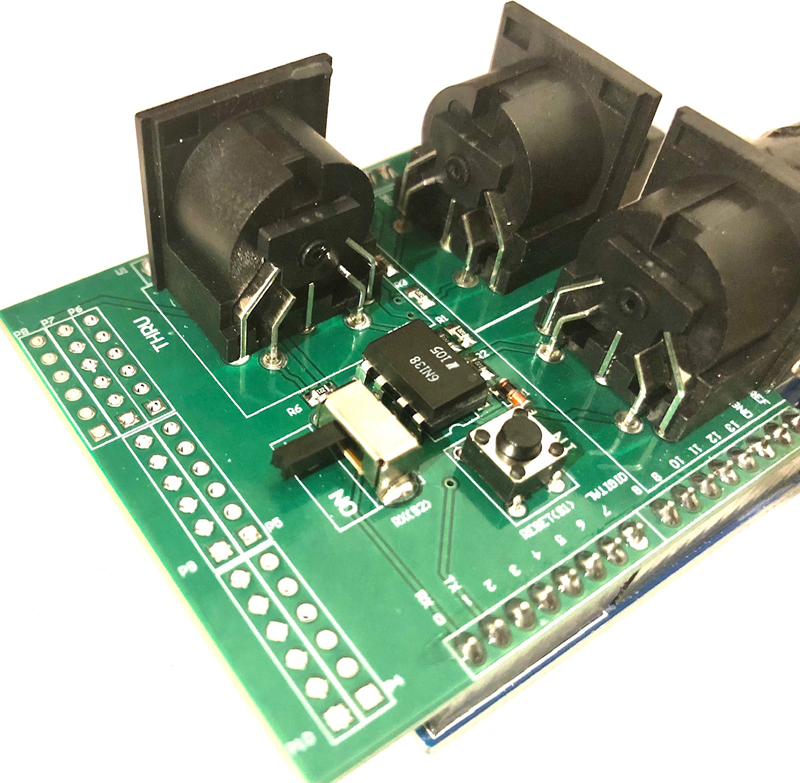

# Harley Benton MP-100 for Headrush Gigboard via Arduino Uno

## Ingredients

- [Harley Benton MP-100](https://images.thomann.de/pics/atg/atgdata/document/manual/432459_c_432459_r1_en_online.pdf) MIDI footswitch
- [Headrush Gigboard](https://www.headrushfx.com/amfile/file/download/file/1025/product/6999/)
- Arduino Uno or compatible
- [Arduino MIDI Shield Breakout Board](https://www.ebay.de/sch/i.html?_nkw=arduino+midi+shield+breakout)

## Why?

- Gigboard seems to expect Control-Change (CC) messages to e.g. trigger the looper commands with a value ("sub-program") of `0`
- In custom mode, MP-100 sends a CC-value of `127` when toggle mode is off, and `127` to toggle `ON` and `0` to toggle `OFF`
- There's no firmware upgrade for either Gigboard or MP-100 as of now to fix the incompatibility
- &rarr; use a programmable device to re-map the values

## Compiling and Uploading the Firmware

- use the [Arduino IDE](https://www.arduino.cc/en/main/software)
- make sure, the blinking example works (correct port, etc)
- open [this project](sketch_oct19a_midi.ino)
- add a zip dependency: [FortySevenEffects/arduino_midi_library](https://github.com/FortySevenEffects/arduino_midi_library), i.e. from the [latest release source zip](https://github.com/FortySevenEffects/arduino_midi_library/releases/latest)
- add the IDE-bundled [Arduino_DebugUtils](https://github.com/arduino-libraries/Arduino_DebugUtils) library
- make sure the shield is connected correctly to the board & switch it off (otherwise, upload will fail)

- turn on the shield

## Caveats

- no warranty whatsoever
- printing to the serial port for debugging purposes will produce garbage after MIDI is initialized (`MIDI.begin`)
- you can debug number via the blinkin LED, i.e. via `blinkNumberInReverseOrder` or your own implementation

## License

    Copyright 2020 Dmitry Ledentsov.

    This Source Code Form is subject to the terms of the Mozilla Public
    License, v. 2.0. If a copy of the MPL was not distributed with this
    file, You can obtain one at http://mozilla.org/MPL/2.0/